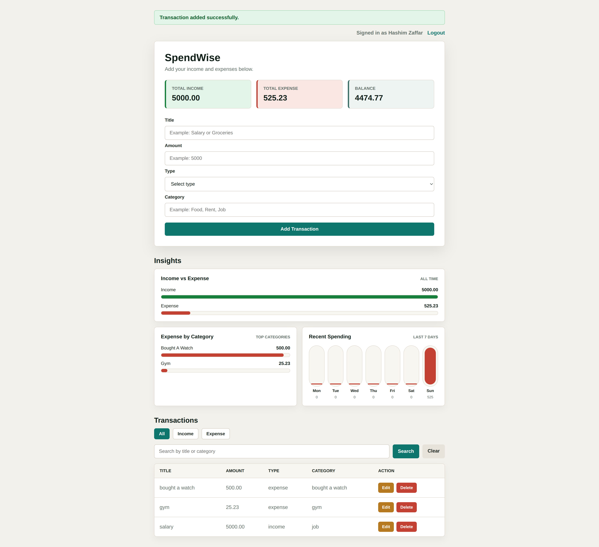

# SpendWise




SpendWise gives users a focused dashboard for tracking income, expenses, balances, and recent spending activity.

SpendWise is a Docker-first personal finance tracker built with small Flask services. It lets users create an account, log in, record income and expenses, search and filter transactions, and review totals with simple dashboard charts.

The app is split into a browser UI, an authentication API, a transaction API, and PostgreSQL databases. Local development is intentionally simple: one Docker Compose command starts the full stack. A local Kubernetes lab is also included for learning deployments with Kind, ingress-nginx, Rancher, ConfigMaps, Secrets, Deployments, Services, Ingress, StatefulSets, and PVCs.

## Features

- Account signup and login with hashed passwords.
- JWT-backed service-to-service authentication.
- Add, edit, delete, filter, and search transactions.
- Income, expense, and balance summary cards.
- Income-vs-expense, expense-by-category, and recent-spending charts.
- CSRF protection for browser form submissions.
- JSON request logs with request IDs.
- Health and readiness endpoints for all services.
- CI, integration smoke tests, dependency scanning, secret scanning, CodeQL, image scanning, and SBOM generation.

## Services

| Service | Port | Purpose |
| --- | ---: | --- |
| `web-app` | host `8000`, container `5000` | Flask/Jinja browser UI and session management |
| `auth-service` | container `5001` | Signup, login, password hashing, JWT issuing, current-user lookup |
| `transaction-service` | container `5002` | JWT-protected transaction CRUD, filtering, summaries, chart data |
| `postgres` | container `5432` | PostgreSQL 16 with separate auth and transaction databases |

## Quick Start

### Docker Compose

Requirements:

- Docker
- Docker Compose

Start the app:

```bash
docker compose up --build
```

Open the browser UI:

```text
http://localhost:8000
```

Stop the stack:

```bash
docker compose down
```

Reset local database data:

```bash
docker compose down -v
```

### Local Kubernetes Lab

The Kubernetes manifests live in `k8s/base/` and deploy into the `spendwise` namespace. In the current Kind lab, ingress-nginx maps host port `8080` to cluster port `80`.

Apply the full app:

```bash
kubectl apply -k k8s/base
```

Check rollout:

```bash
kubectl rollout status deployment/auth-service -n spendwise
kubectl rollout status deployment/transaction-service -n spendwise
kubectl rollout status deployment/web-app -n spendwise
kubectl rollout status statefulset/postgres -n spendwise
```

Open the Kubernetes app:

```text
http://spendwise.localhost:8080
```

The app Deployments run two replicas each. PostgreSQL runs as one StatefulSet pod with a PVC.

## Docker Helper

The helper script wraps common Docker Compose tasks:

```bash
python3 scripts/docker_tools.py up
python3 scripts/docker_tools.py status
python3 scripts/docker_tools.py logs
python3 scripts/docker_tools.py health
python3 scripts/docker_tools.py down
python3 scripts/docker_tools.py clean
```

`clean` removes Compose volumes and orphaned containers.

## Configuration

The Docker Compose file includes safe local defaults. To customize local settings:

```bash
cp .env.example .env
```

Then edit `.env`. Do not commit `.env`; only `.env.example` belongs in source control.

Common settings:

| Variable | Default | Purpose |
| --- | --- | --- |
| `APP_ENV` | `production` | Runtime mode used by all services |
| `LOG_LEVEL` | `INFO` | JSON log level |
| `WEB_APP_HOST_PORT` | `8000` | Host port mapped to the web app |
| `POSTGRES_USER` | `spendwise_user` | PostgreSQL user |
| `POSTGRES_PASSWORD` | `spendwise_password` | PostgreSQL password |
| `SECRET_KEY` | `change-this-local-secret` | Flask session signing key |
| `JWT_SECRET` | `change-this-local-jwt-secret` | JWT signing key shared by auth and transaction services |
| `JWT_EXPIRES_MINUTES` | `120` | Auth token lifetime |
| `SERVICE_TIMEOUT_SECONDS` | `5` | Web-app timeout for backend service requests |
| `SESSION_COOKIE_SECURE` | `false` | Set to `true` behind HTTPS |
| `SESSION_COOKIE_HTTPONLY` | `true` | Prevent browser JavaScript from reading the session cookie |
| `SESSION_COOKIE_SAMESITE` | `Lax` | Session cookie SameSite policy |

## Health Checks

After the app starts:

```bash
curl -i http://localhost:8000/health
curl -i http://localhost:8000/ready
```

`/health` confirms the web process is running. `/ready` also checks the auth and transaction services, which each check PostgreSQL.

## Local Quality Checks

Install local development tooling:

```bash
python3 -m venv .venv
source .venv/bin/activate
pip install -r requirements-dev.txt
```

Run all local CI checks:

```bash
python3 scripts/ci_check.py
```

The full run starts the Docker Compose stack, runs the integration smoke test, and removes the local Compose volume at the end. Use it when local database data is disposable.

Skip the destructive integration smoke test while still running lint, syntax, Compose config, and Docker builds:

```bash
python3 scripts/ci_check.py --skip-integration
```

Skip Docker Compose config, build, and integration checks when you only need the Python checks:

```bash
python3 scripts/ci_check.py --skip-build
```

Run lint directly:

```bash
ruff check services scripts
```

The current local check script runs lint, Python syntax checks, Docker Compose config validation, Docker image builds, and an integration smoke test. There is not a separate unit-test suite yet.

## Documentation

- [Architecture](docs/ARCHITECTURE.md)
- [Local Development](docs/DEVELOPMENT.md)
- [API Reference](docs/API.md)
- [Operations](docs/OPERATIONS.md)
- [Kubernetes Local Lab](docs/KUBERNETES.md)
- [Security](docs/SECURITY.md)
- [SpendWise Container Images](docs/local-devops/spendwise-images.md)
- [Rancher Lab](k8s/lab/README.md)
- [GitHub Actions Security Rules](.github/SECURITY_RULES.md)

## Project Structure

```text
SpendWise/
  README.md
  app-frontend.png
  .gitleaks.toml
  .env.example
  docker-compose.yml
  pyproject.toml
  requirements-dev.txt
  docs/
    API.md
    ARCHITECTURE.md
    DEVELOPMENT.md
    KUBERNETES.md
    OPERATIONS.md
    SECURITY.md
    local-devops/
      spendwise-images.md
      tool-versions.md
    local-lab/
      step-04-tools.md
  k8s/
    base/
      00-namespace.yaml
      01-configmap.yaml
      02-secret.yaml
      02a-postgres-init-configmap.yaml
      03-postgres.yaml
      04-auth-service.yaml
      05-transaction-service.yaml
      06-web-app.yaml
      07-ingress.yaml
      kustomization.yaml
    lab/
      kind-rancher.yaml
      README.md
    planning/
      docker-compose-to-kubernetes.md
    rancher/
      notes.md
  .github/
    SECURITY_RULES.md
    dependabot.yml
    workflows/
      ci.yml
      docker-build.yml
      security.yml
  database/
    init/
      01-create-spendwise-databases.sql
  scripts/
    ci_check.py
    docker_tools.py
    integration_test.py
  services/
    auth-service/
      app.py
      Dockerfile
      requirements.txt
    transaction-service/
      app.py
      Dockerfile
      requirements.txt
    web-app/
      app.py
      Dockerfile
      requirements.txt
      static/
      templates/
```
